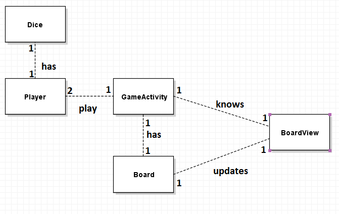

## 5710546372 Pipatpol Tanavongchinda
Snake Ladder
========

Domain model
--------

### I break classes into
* GameActivity
* BoardView
* Player
* Dice
* Board (use Singleton Pattern)

GRASP Creator
-----------
#### Game create Player and Board.

My game creates 2 players and board, this class is a central logic of  game that manage turn of player and update board.

#### Player create Dice

My code is redundancy because in game it has only one dice to roll but I create two individual dice of player. Main purpose is create dice for roll.

GRASP Controller
---------------
GameActivity is a controller control a logic in game and record information to board,then board tell the boardView to show the current situation in the game.
